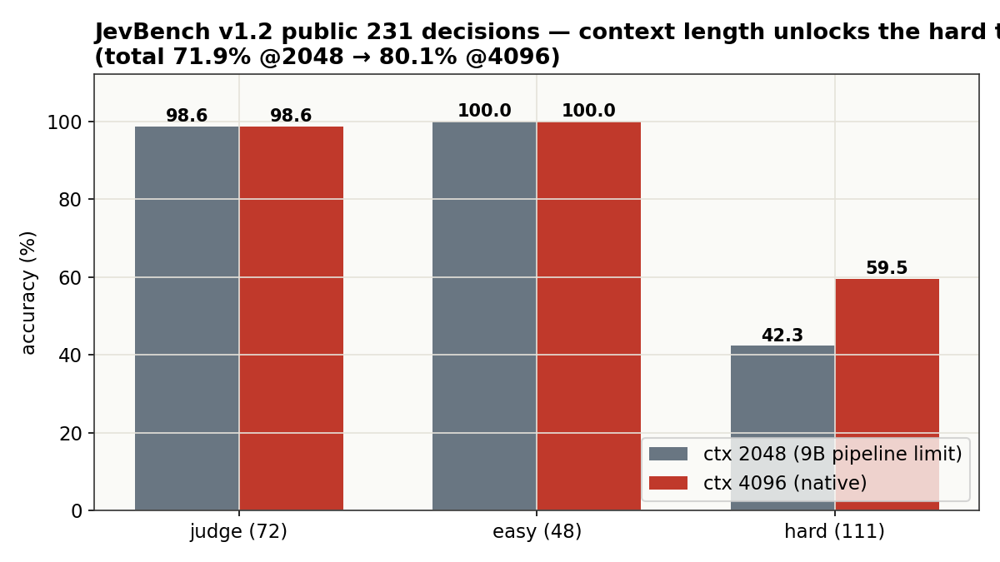

# Metask-Jev-4B

A calibrated **typed-decision model**: give it a piece of state (text, ticket, policy, JSON) and a typed question — `choice`, `boolean`, or rubric `score` — and it returns a probability for every option in a **single forward pass (~24 ms on a 4090)**. No generation, no parsing, nothing to hallucinate.

**Headline numbers** — all measured on public human-labeled data, never on our own training mix:

| Benchmark | metask-jev-4b | Bespoke Nimble-9B | Jev 1.13.0 |
|---|---:|---:|---:|
| 13 public human-labeled subsets (3,880 items), macro | **79.6%** | 74.8% | 76.0% |
| JevBench v1.2 public 231 decisions @4096 ctx | **80.1%** | 63.5% (total score) | 75.3 (total score) |
| Calibration, ECE after per-kind temperature | **0.028** | — | — |
| p50 latency (RTX 4090, single question) | **~24 ms** | ~190 ms (A40) | 236–276 ms |

12 of the 13 subsets exceed Bespoke Nimble-9B — a model 2.2× its size — with the same prompt format and scoring protocol.


## Quickstart

```python
from jev_scorer import load_model, score

model, tok, dev = load_model("Raymond1122/metask-jev-4b-policy-mix")

state = ("The store accepts returns within 30 days of purchase. "
         "This item was bought 12 days ago and is unopened.")
schema = {"decision": {
    "description": "Is the item still eligible for return?",
    "type": "boolean",                      # "enum" for choice, "boolean" for yes/no
    "choices": [False, True],
    "choice_descriptions": {"false": "Not eligible.", "true": "Eligible."},
}}

r = score(model, tok, state, schema, temperature=2.25)   # noul temperature
print(r["prediction"], r["probabilities"])
# True {'false': 0.013, 'true': 0.987}
```

Answer tokens A–Z are verified single tokens for this tokenizer at load time; probabilities come from a softmax over exactly those logits — the model never generates.

## Benchmarks

### 13 public human-labeled subsets (3,880 items)

The primary suite: BoolQ, MultiNLI, PAWS, PubMedQA, SQuAD-2, VitaminC, Civil Comments, Aegis 2.0, MASSIVE (en/de), HelpSteer-2, SummEval (consistency/relevance). Every item is human-labeled; the suite is byte-reproducible (manifest-locked ids + sha256) and shared with the Bespoke Nimble evaluation protocol.

| subset | type | n | metask-jev-4b | 95% CI | Nimble-9B | Δ |
|---|---|---:|---:|---|---:|---:|
| civil_comments | noul | 300 | **91.3%** | 87.6–94.0 | 70.3% | +21.0 |
| paws | noul | 250 | **94.0%** | 90.3–96.3 | 82.8% | +11.2 |
| vitaminc | choice | 599 | **86.8%** | 83.9–89.3 | 76.6% | +10.2 |
| summeval-consistency | score | 144 | **85.4%** | 78.7–90.3 | 75.7% | +9.7 |
| squad2 | noul | 299 | **89.0%** | 84.9–92.0 | 80.6% | +8.4 |
| massive-de-DE | choice | 350 | **91.1%** | 87.7–93.7 | 83.4% | +7.7 |
| multinli | choice | 299 | **90.0%** | 86.0–92.9 | 85.3% | +4.7 |
| helpsteer2 | score | 249 | **43.0%** | 37.0–49.2 | 39.0% | +4.0 |
| massive-en-US | choice | 350 | **90.9%** | 87.4–93.4 | 86.9% | +4.0 |
| aegis2 | noul | 250 | **83.2%** | 78.1–87.3 | 81.2% | +2.0 |
| boolq | noul | 300 | **87.3%** | 83.1–90.6 | 86.0% | +1.3 |
| pubmedqa | choice | 250 | **76.0%** | 70.3–80.9 | 75.6% | +0.4 |
| summeval-relevance | score | 240 | 26.7% | 21.5–32.6 | 49.2% | −22.5 |
| **macro** | | 3,880 | **79.6%** | | 74.8% | **+4.8** |

Where it wins: verification-style noul (civil +21.0, paws +11.2) and rubric score on consistency (+9.7). Where it loses: summeval-relevance — a 5-level rubric with a systematic 3↔4 boundary shift; see [Honest limits](#honest-limits).

### JevBench v1.2 — public 231 decisions



| tier | items | @ctx 2048 | @ctx 4096 |
|---|---:|---:|---:|
| judge (original) | 72 | 98.6% | 98.6% |
| easy | 48 | 100.0% | 100.0% |
| hard | 111 | 42.3% | **59.5%** |
| **total** | 231 | 71.9% | **80.1%** |

The hard tier contains long policy documents. At the 9B pipeline's 2048-token limit, 36 of 111 items are rejected (422 = scored wrong); this model natively handles 4096, and answers 88% of those previously-rejected items correctly. **Context length, not capability, was the bottleneck.**

### Calibration


Ships over-confident like every model in this family. One temperature per question kind, fit by NLL minimization on a held-out validation split (never on eval):

| kind | T |
|---|---:|
| choice | 1.7875 |
| noul | 2.25 |
| score | 2.05 |

ECE (10 bins, macro over 13 subsets): **0.100 → 0.028**. Apply at inference: `probs = softmax(logits / T_kind)`.

### Score evolution


### Speed


| system | p50 / decision | hardware |
|---|---:|---|
| metask-jev-4b | **~24 ms** | RTX 4090 |
| Bespoke Nimble-9B | ~190 ms | A40 |
| Jev 1.13.0 (published) | 236–276 ms | production API |

Single forward pass over the prompt, one softmax over ≤26 candidate logits. Batched serving scales linearly.

## Training

1. **Backbone**: Qwen3.5-4B @ `851bf6e`, LoRA r16 α32 on all language-model linear layers, merged at release.
2. **Supervision**: 44.8k view-augmented decisions from 11 public datasets (3 criteria orderings per item; the gold label follows its option, which kills position-collapse priors).
3. **Policy-mix**: 390 synthetic policy-family decisions (long_policy, multi_hop, temporal_numeric, judge_hard, trap, probability, ambiguous, adversarial, tradeoff) with teacher soft labels, 2× upsampled — mirroring the JevBench hard-tier families at ≤2048-token states.
4. **Objective**: candidate cross-entropy at the last prompt position. 1 epoch, lr 2e-5, batch 4×2, BF16 + gradient checkpointing. Single RTX 4090, 2h34m, peak 19 GB.

The training objective and prompt format are unchanged from the official Nimble protocol; the recipe card with reproduction commands is in the [GitHub repo](https://github.com/metask-ai/metask-jev).

## Honest limits

- **summeval-relevance (26.7%)** is the one clear regression vs 9B (49.2%): a 5-level rubric where the model systematically shifts 3↔4 at one boundary. NLL and expected-score error are actually *better* than 9B; the argmax metric amplifies the boundary shift. If your use case is fine-grained relevance scoring, evaluate this subset yourself first.
- **helpsteer2 (43.0%)**: rubric scoring is the weakest primitive family-wide (9B 39.0%, Jev ~50%).
- **1 item over 4096 tokens** is still rejected (422-scored-wrong under JevBench protocol).
- **Distillation share**: 390 of 45.6k training decisions (~0.9%) carry teacher soft labels; the rest are human-labeled public data.
- Temperatures are fit on our validation split. Refit on your own data before trusting probabilities in a new domain (one NLL sweep, minutes).

## Intended use & safety

Designed for routing, triage, moderation, guardrails, evidence-grounded verification, and rubric scoring where calibrated probabilities matter more than generated explanations. Not a generative model; it cannot produce free-form text or reasoning.

## Links

- GitHub (inference + recipes): https://github.com/metask-ai/metask-jev
- JevBench: https://github.com/fstandhartinger/jevbench
- Prompt/scoring protocol: https://github.com/bespokelabsai/nimble

## Licence

Apache-2.0. Qwen3.5-4B base keeps its own terms.