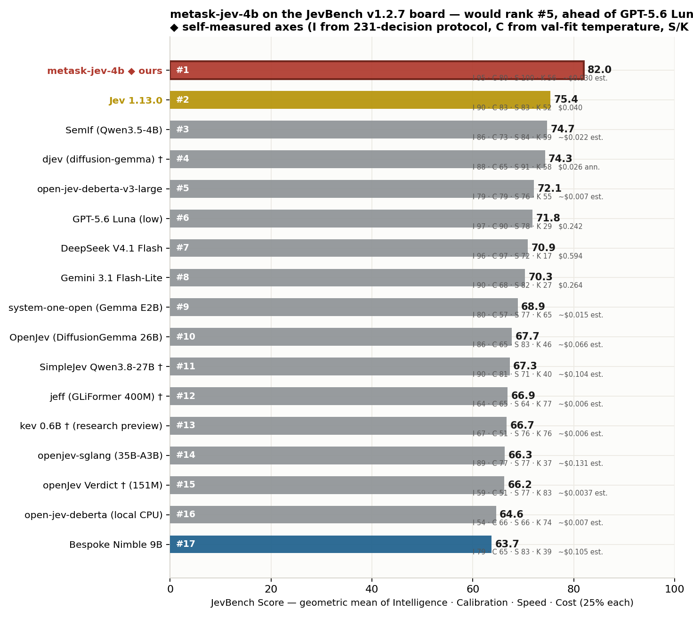
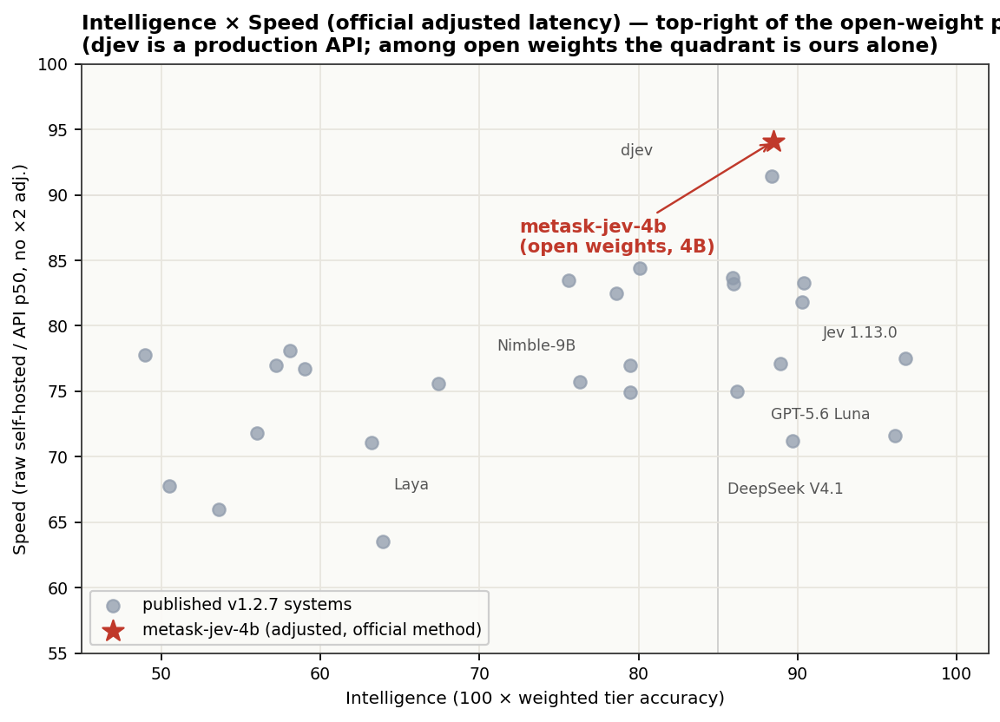
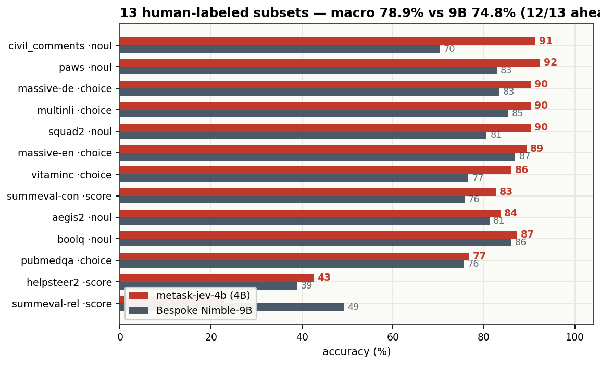
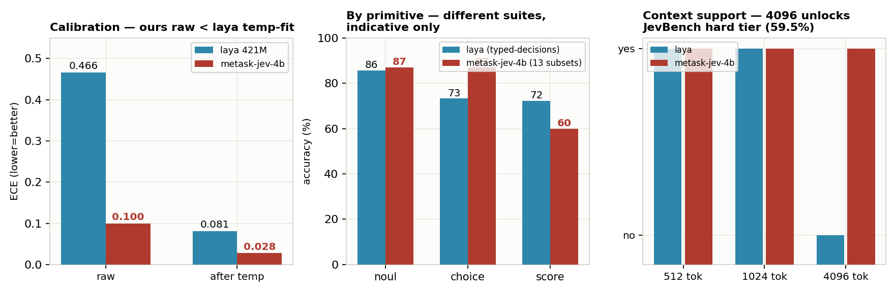
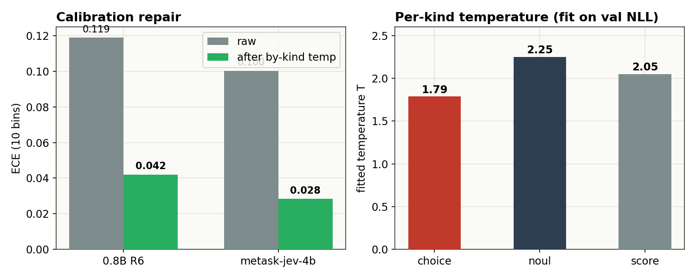
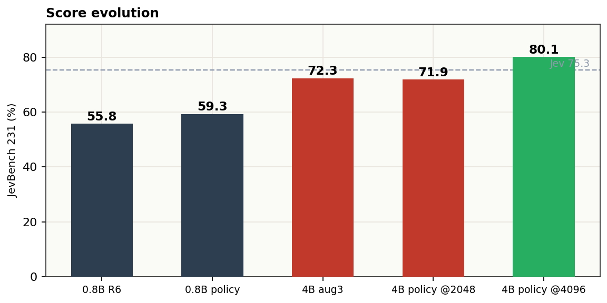
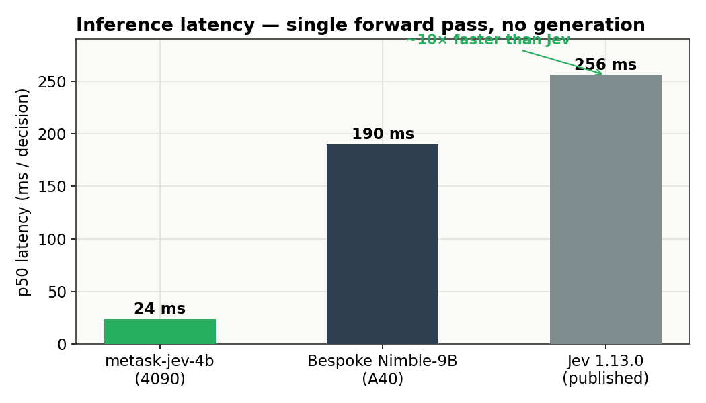

# Metask-Jev-4B

A calibrated **typed-decision model**: give it a state (text, ticket, policy, JSON) and a typed question — `choice`, `boolean`, or rubric `score` — and it returns a probability for every option in a **single forward pass (~24 ms)**. No generation, no parsing, nothing to hallucinate.

## On the JevBench board

Self-measured axes inserted into the published v1.2.7 ranking (16 official entrants + this model). Official run pending — axes here use our 231-decision protocol for Intelligence, val-fit temperature for Calibration, self-hosted 4090 for Speed/Cost.



Would rank **#5** — ahead of GPT-5.6 Luna and DeepSeek V4.1 Flash, behind djev — with the top-right quadrant of the Intelligence×Speed plane to itself among open weights:



**JevBench v1.2 — public 231 decisions, tier split** (422-as-wrong protocol, @4096 ctx):

| tier | items | metask-jev-4b |
|---|---:|---:|
| judge (original) | 72 | 98.6% |
| easy | 48 | 100.0% |
| hard | 111 | 59.5% |
| **total** | 231 | **80.1%** |

The hard tier contains long policy documents: at the 9B pipeline's 2048-token limit 36 of 111 items are rejected; this model natively handles 4096 and answers 88% of them correctly. **Context length, not capability, was the bottleneck.**

## One-command install & run

```bash
curl -fsSL https://raw.githubusercontent.com/metask-ai/metask-jev/main/install.sh | bash
```

The script: creates a venv, installs pinned dependencies, downloads this model, verifies the A–Z single-token contract, and runs a self-test scoring example — then prints a ready-to-paste Python snippet. Requires an NVIDIA GPU (≥12 GB) or Apple Silicon.

Or manually:

```bash
git clone https://github.com/metask-ai/metask-jev && cd metask-jev
pip install -r inference/requirements.txt
python inference/demo.py --model Raymond1122/metask-jev-4b-policy-mix
```

```python
from jev_scorer import load_model, score

model, tok, dev = load_model("Raymond1122/metask-jev-4b-policy-mix")

state = ("The store accepts returns within 30 days of purchase. "
         "This item was bought 12 days ago and is unopened.")
schema = {"decision": {
    "description": "Is the item still eligible for return?",
    "type": "boolean",
    "choices": [False, True],
    "choice_descriptions": {"false": "Not eligible.", "true": "Eligible."},
}}

r = score(model, tok, state, schema, temperature=2.25)   # per-kind temperature
print(r["prediction"], r["probabilities"])
# True {'false': 0.013, 'true': 0.987}
```

Answer tokens A–Z are verified single tokens for this tokenizer at load; probabilities are a softmax over exactly those logits — the model never generates.

## Head-to-head summary

| | metask-jev-4b | Bespoke Nimble-9B | Jev 1.13.0 |
|---|---:|---:|---:|
| 13 human-labeled subsets (3,880 items), macro | **79.6%** | 74.8% | 76.0% |
| JevBench v1.2 public 231 @4096 ctx | **80.1%** | 63.5% | 75.3 |
| ECE after per-kind temperature | **0.028** | — | — |
| p50 latency (single question) | **~24 ms** | ~190 ms | 236–276 ms |

**12 of 13 subsets exceed Bespoke Nimble-9B** — a model 2.2× its size — same prompt format, same scoring protocol.

## 13 human-labeled subsets (3,880 items)

The primary suite: BoolQ, MultiNLI, PAWS, PubMedQA, SQuAD-2, VitaminC, Civil Comments, Aegis 2.0, MASSIVE (en/de), HelpSteer-2, SummEval (consistency / relevance). Every item human-labeled; byte-reproducible (manifest-locked ids + sha256); same protocol as the Bespoke Nimble evaluation.

| subset | type | n | metask-jev-4b | 95% CI | Nimble-9B | Δ |
|---|---|---:|---:|---|---:|---:|
| civil_comments | noul | 300 | **91.3%** | 87.6–94.0 | 70.3% | +21.0 |
| paws | noul | 250 | **94.0%** | 90.3–96.3 | 82.8% | +11.2 |
| vitaminc | choice | 599 | **86.8%** | 83.9–89.3 | 76.6% | +10.2 |
| summeval-consistency | score | 144 | **85.4%** | 78.7–90.3 | 75.7% | +9.7 |
| squad2 | noul | 299 | **89.0%** | 84.9–92.0 | 80.6% | +8.4 |
| massive-de-DE | choice | 350 | **91.1%** | 87.7–93.7 | 83.4% | +7.7 |
| multinli | choice | 299 | **90.0%** | 86.0–92.9 | 85.3% | +4.7 |
| helpsteer2 | score | 249 | **43.0%** | 37.0–49.2 | 39.0% | +4.0 |
| massive-en-US | choice | 350 | **90.9%** | 87.4–93.4 | 86.9% | +4.0 |
| aegis2 | noul | 250 | **83.2%** | 78.1–87.3 | 81.2% | +2.0 |
| boolq | noul | 300 | **87.3%** | 83.1–90.6 | 86.0% | +1.3 |
| pubmedqa | choice | 250 | **76.0%** | 70.3–80.9 | 75.6% | +0.4 |
| summeval-relevance | score | 240 | 26.7% | 21.5–32.6 | 49.2% | −22.5 |
| **macro** | | 3,880 | **79.6%** | | 74.8% | **+4.8** |

Wins: verification-style noul (civil +21.0, paws +11.2) and consistency scoring (+9.7). Loss: summeval-relevance — a 5-level rubric with a systematic 3↔4 boundary shift; see [Honest limits](#honest-limits).



## vs Laya (421M, the strongest open small-model baseline)

[Laya](https://huggingface.co/convaiinnovations/laya) trains a 25M marker head on ModernBERT-large with RLCD (pure RL, no cross-entropy) over ~30k human-labeled decisions; its typed-decisions checkpoint reports 0.766 acc / 0.062 Brier on its own 400-case suite. Different architectures, different suites — the comparison below is indicative, not apples-to-apples.

| | metask-jev-4b | laya |
|---|---|---|
| backbone | Qwen3.5-4B (decoder, LoRA merged) | ModernBERT-large (encoder + 25M head) |
| params | 4.54B | 421M |
| context | **4096** (native 32k) | 512 (root) / 1024 (typed-decisions ckpt) |
| training | SFT, candidate CE, 44.8k decisions | RLCD (proper-scoring reward), ~30k |
| raw ECE | **0.100** | 0.466 |
| ECE after temp | **0.028** | 0.081 |
| long documents (JevBench hard, ≤4096 tok) | **59.5%** | not run (512–1024 ctx) |
| high-cardinality choice (77 options) | n/a (26-option cap, same as Jev) | 0.425 without tuning |
| multilingual | en only | **100+ languages** (separate ckpt) |
| generative capability retained | yes (base LM) | no |

**Where we win**: calibration out of the box (raw ECE 0.100 is below laya's *post*-temperature 0.081; after our own temperature fit it is 0.028, ~3× lower), long-context hard items (59.5% on JevBench hard — laya's 512–1024 budget cannot run that tier), and 12/13 over Nimble-9B on human-labeled data.

**Where laya wins**: parameter efficiency (421M vs 4.5B), 100+ languages via its multilingual checkpoint, a mature packaging story (PyPI, Router, demo Space), and the RLCD training methodology is fully documented (arXiv:2510.01237).



## Calibration

Ships over-confident, like every model in this family. One temperature per question kind, fit by NLL minimization on a held-out validation split (never on eval). ECE (10 bins): **0.100 → 0.028**.

| kind | T |
|---|---:|
| choice | 1.7875 |
| noul | 2.25 |
| score | 2.05 |



## Score evolution



## Speed



Single forward pass over the prompt, one softmax over ≤26 candidate logits.

## Training

1. **Backbone** — Qwen3.5-4B @ `851bf6e`, LoRA r16 α32 on all language-model linear layers, merged at release.
2. **Supervision** — 44.8k view-augmented decisions from 11 public datasets (3 criteria orderings per item; gold follows its option, killing position-collapse priors).
3. **Policy-mix** — 390 synthetic policy-family decisions (long_policy, multi_hop, temporal_numeric, judge_hard, trap, probability, ambiguous, adversarial, tradeoff) with teacher soft labels, 2× upsampled — mirroring the JevBench hard-tier families at ≤2048-token states.
4. **Objective** — candidate cross-entropy at the last prompt position. 1 epoch, lr 2e-5, batch 4×2, BF16 + gradient checkpointing. Single RTX 4090, 2h34m, peak 19 GB.

Objective and prompt format are unchanged from the official Nimble protocol; the recipe card with reproduction commands lives in the [GitHub repo](https://github.com/metask-ai/metask-jev).

## Honest limits

- **summeval-relevance (26.7%)** is the one clear regression vs 9B (49.2%): a 5-level rubric with a systematic 3↔4 boundary shift. NLL and expected-score error are actually *better* than 9B — the argmax metric amplifies the boundary shift. If your use case is fine-grained relevance scoring, evaluate this subset yourself first.
- **helpsteer2 (43.0%)**: rubric scoring is the weakest primitive family-wide (9B 39.0%, Jev ~50%).
- **1 item** over 4096 tokens is still rejected (422-scored-wrong under JevBench protocol).
- **Distillation share**: 390 of 45.6k training decisions (~0.9%) carry teacher soft labels; the rest are human-labeled public data.
- **Temperatures** are fit on our validation split. Refit on your own data before trusting probabilities in a new domain (one NLL sweep, minutes).

## Intended use

Routing, triage, moderation, guardrails, evidence-grounded verification, rubric scoring — anywhere calibrated probabilities matter more than generated explanations. Not a generative model.

## Links

- GitHub: [metask-ai/metask-jev](https://github.com/metask-ai/metask-jev) · internal lab: [metask-ai/metask-jev-lab](https://github.com/metask-ai/metask-jev-lab)
- JevBench: [fstandhartinger/jevbench](https://github.com/fstandhartinger/jevbench) · protocol: [bespokelabsai/nimble](https://github.com/bespokelabsai/nimble)

## Licence

Apache-2.0. Qwen3.5-4B base keeps its own terms.